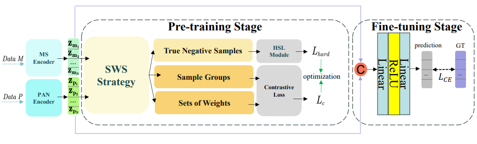

# SLCL

## PyTorch implementation of "Sample-Level Improved Cross-Source Contrastive Learning for PAN and MS Joint Classification".

## Installation
Clone the repository and run

    conda env create --name SLCL --file env.yml
    conda activate SLCL
    python pretrain.py

## Evaluation

We measure the quality of the learned representations by linear separability.

    python evaluation.py